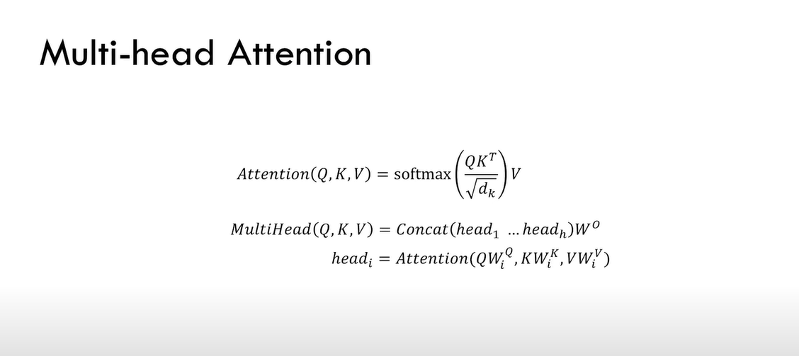

# Llama2 from scratch

This is a follow-along activity from Umar Jamil's excellent youtube video on the same
> https://www.youtube.com/watch?v=oM4VmoabDAI

## ROPE
See nicely `x` and `d` and $\theta$ - all are predefined. The first image below is the more code-able form. Next image with the big matrix is same, but messy to code

## RMSNorm
Earlier frameworks did either batch norm or layernorm. **But RMSNorm paper says recentering is not necessary (computing mean), only scaling is necessary.**

A new statistic (RMS statistic) is introduced, that does not require recentering by mean (does not calculate mean and therefore variance also since variance depends on mean)

## Attention

### Issues with Attention
 

Say at T=3, the usual computation gives 3 attention vectors i.e. it will **recompute the attention of previously calculated tokens**! Note that new token prediction is one-by-one only (seq2seq)

At T=4, again all **prev attention scores** are computed
 

### KV Cache
We directly use the last token in the `Query` only. The Query needs access to previous `Keys` and `Values` so we keep appending to them.

> $QK^{T}$ has only the useful row

> multiplying with `V` gives only the useful attention

### Grouped Query Attention
Issue: GPUs are very fast at doing computations than doing computations/transfers across memory - new bottleneck is about memory transfers

Solution A: Optimise memory access, but loose some performace - **Multi query attention** with KV cache --> Reduce number of heads for key and value (reason for less performance)

Solution B: **Grouped Multi Query Attention**
Multi head is best performance, Multi query is fastest

### SwiGLU

### Logits

### Inference strategies
**Greedy** --> choose the one with highest probability at each time step --> append it to the input and then choose the next token similarly. *Performs poorly*

**Beam Search (with k)** --> At every step, we keep alive the top `k` paths and all others are killed --> increases inference time. *Performs better than greedy*

**Temperature**

Without temperature, highest logit gets high probability. After temperature (logits divided by LOW Temp), values become higher - softmax amplifies the diferences - higher probability of top token - CONFIDENT Model. \
HIGH Temp - less CONFIDENT

**Random Sampling**

**Top K**

Good but still possible a bad token shows up in the top K. We want to avoid this *but still want to have some randomness*

**Top P -- Used in LLaMA**
Solves problem of top K by considering a cutoff on the cumulative probabilty also.

When many tokens have similar probability, we choose more tokens (high cumulative probability achieved later)
When some tokens have high, we cutoff at less tokens only (high cumulative probability achieved earlier)

